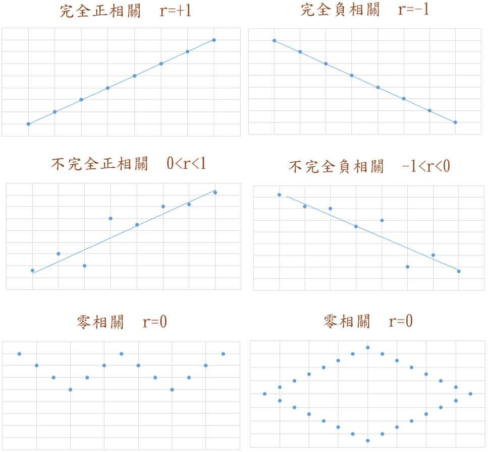
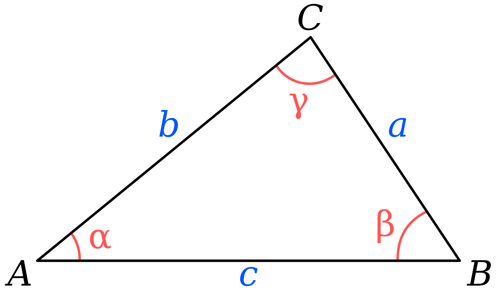
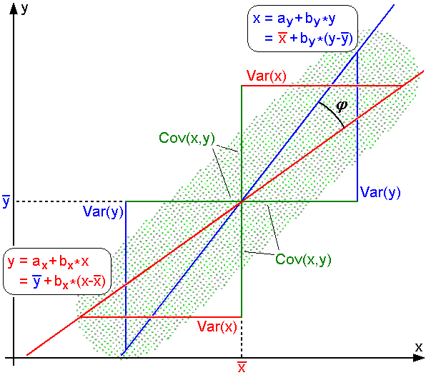

#Section2 
___
##一 前言
多數人都會對資料的相關性跟因果性有所混淆，比如A和B有因果姓，則當A發生時B一定會發生，但如果說A和B有相關性時，只能說A發生時B有可能會發生，又好比酒精濃度高與交通事故率相關性高，但並不代表酒駕導致交通事故率高若且惟若。

從事資料分析中，往往我們所探討的問題與問題之間的相關係，像是體重是否跟身高有相關性，有沒有養寵物跟有沒有過敏體質有相關性，這些問題中是否存在著某種相關性在統計學上稱為相關(Correlation)，然而有了指標他又代表哲甚麼意義呢?

一般而言，欲了解兩筆資料間的相關性，最直接的方法就是將兩筆資料的數據標示於座標圖上，並觀察其散步情形，根據其散步程度我們就能對這兩筆資料的相關性略知一二。

##二 相關係數
若兩資料間存在直線關係，可由相關係數來描述其相關強弱

$$
\begin{aligned}
correlation\ coeficient = \frac{Cov(a,b)}{\sqrt{Var(a)Var(b)}}
\end{aligned}
$$
以上為標準化方差，他可以用來表示兩個隨機變量的相關性，且$R$是元素介於`[-1,1]`之間的方陣($R\in \R^{DxD}$ )，如果我們將數據點視為x的i.i.d.樣本，那我們就可以評估他們的$R_{ij}$

$$
\begin{aligned}
\bar{R}_{ij} =  \frac { \sum_{i=1}^{n}(x_i - \bar{\mu_{x_i}})(y_i - \bar{\mu_{y_i}}) } 
{ \sqrt{ \sum_{i=1}^{n}(x_i - \bar{\mu_{x_i}})^2(y_i - \bar{\mu_{y_i}})^2} }
=\frac { \bar{\sigma}_{xy} } { \bar{\sigma}_x\bar{\sigma}_y  }
\end{aligned}
$$

>**Note i.i.d. Indenpent and identically distribution (獨立同分布)**
>意即抽樣到的data distribution一模一樣且互相獨立，所謂一模一樣就是population的參數都一樣。
___
##相關係數與散布圖

r值介於-1與1之間，如圖一兩變數呈現左下右上的趨勢時，則兩變數之間存在正相關，其相關係數>0;若散佈程度坐上右下時，其相關係數<0;若散佈程度**非線性**或不規則狀，則其係數趨近於零。
正負相關又可表示為完全正、負相關與不完全正、負相關，
___
##幾何學角度的解釋

對於沒有**中心化**的數據，相關係數與兩條可
能的回歸線$y=g_{x}(x)$和$x=g_{y}(y)$夾角的
餘弦值一致。

>**餘弦定理**$$c^2 = a^2 + b^2 - 2ab\cos \gamma$$

對於中心化過的數據(樣本平均為0)，相關係數
可以被視作由兩個隨機變量向量夾角$\theta$的餘弦值
例如:有五格國家的國民生產總值分別為:10、20
、30、50和80億美元。假設這五個國家的貧困
百分比分別為11%、12%、13%、15%和18%。
令x和y分別等於包含上述五個數據的向量

$x=(1,2,3,5,8)$
$y=(0.11,0.12,0.13,0.15,0.18)$

利用通常的方法計算兩向量的夾角$\theta$，為中心化係數為:
$$
\cos \theta = \frac {x \cdot y} {\lvert\lvert{x}\rvert\rvert\lvert\lvert{y}\rvert\rvert}=\frac{2.93}{\sqrt{103} \sqrt{0.0983}} = 0.920814711.
$$
以上數據為完全相關。但如果將數據中心化基於$E(x)=3.8$移動$x$ 、$E(y)$移動$y$。

$x=(-2.8,-1.8,-0.8,1.2,4.2)$
$y=(-0.028,-0.018,-0.008,0.012,0.042)$

$$
\cos \theta = \frac {x \cdot y} {\lvert\lvert{x}\rvert\rvert\lvert\lvert{y}\rvert\rvert}=\frac {0.0308}{\sqrt{30.8} \sqrt{0.00308}} = 1 = \rho_{xy}.
$$
___
##Z-normalize

___