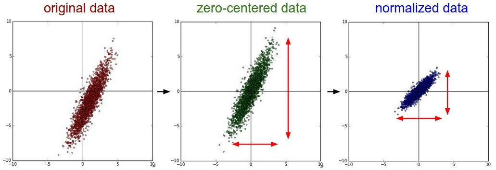

#Section2 
___
##一 前言
多數人都會對資料的相關性跟因果性有所混淆，比如A和B有因果姓，則當A發生時B一定會發生，但如果說A和B有相關性時，只能說A發生時B有可能會發生，又好比酒精濃度高與交通事故率相關性高，但並不代表酒駕導致交通事故率高若且惟若。

從事資料分析中，往往我們所探討的問題與問題之間的相關係，像是體重是否跟身高有相關性，有沒有養寵物跟有沒有過敏體質有相關性，這些問題中是否存在著某種相關性在統計學上稱為相關(Correlation)，然而有了指標他又代表哲甚麼意義呢?

一般而言，欲了解兩筆資料間的相關性，最直接的方法就是將兩筆資料的數據標示於座標圖上，並觀察其散步情形，根據其散步程度我們就能對這兩筆資料的相關性略知一二。

##二 相關係數
若兩資料間存在直線關係，可由相關係數來描述其相關強弱

$$
\begin{aligned}
correlation\ coeficient = \frac{Cov(a,b)}{\sqrt{Var(a)Var(b)}}
\end{aligned}
$$
以上為標準化方差，他可以用來表示兩個隨機變量的相關性，且$R$是元素介於`[-1,1]`之間的方陣($R\in \R^{DxD}$ )，如果我們將數據點視為x的i.i.d.樣本，那我們就可以評估他們的$R_{ij}$

$$
\begin{aligned}
\bar{R}_{ij} =  \frac { \sum_{i=1}^{n}(x_i - \bar{\mu_{x_i}})(y_i - \bar{\mu_{y_i}}) } 
{ \sqrt{ \sum_{i=1}^{n}(x_i - \bar{\mu_{x_i}})^2(y_i - \bar{\mu_{y_i}})^2} }
=\frac { \bar{\sigma}_{xy} } { \bar{\sigma}_x\bar{\sigma}_y  }
\end{aligned}
$$

>**Note i.i.d. Indenpent and identically distribution (獨立同分布)**
>意即抽樣到的data distribution一模一樣且互相獨立，所謂一模一樣就是population的參數都一樣。
___
##相關係數與散布圖


r值介於-1與1之間，如圖一兩變數呈現左下右上的趨勢時，則兩變數之間存在正相關，其相關係數>0;若散佈程度坐上右下時，其相關係數<0;若散佈程度**非線性**或不規則狀，則其係數趨近於零。
正負相關又可表示為完全正、負相關與不完全正、負相關，
___
##幾何學角度的解釋

對於沒有**中心化**的數據，相關係數與兩條可
能的回歸線$y=g_{x}(x)$和$x=g_{y}(y)$夾角的
餘弦值一致。

>**餘弦定理**$$c^2 = a^2 + b^2 - 2ab\cos \gamma$$


**對於中心化過的數據(樣本平均為0)，相關係數
可以被視作由兩個隨機變量向量夾角$\theta$的餘弦值**
例如:有五格國家的國民生產總值分別為:10、20
、30、50和80億美元。假設這五個國家的貧困
百分比分別為11%、12%、13%、15%和18%。
令x和y分別等於包含上述五個數據的向量

$x=(1,2,3,5,8)$
$y=(0.11,0.12,0.13,0.15,0.18)$

利用通常的方法計算兩向量的夾角$\theta$，為中心化係數為:
$$
\cos \theta = \frac {x \cdot y} {\lvert\lvert{x}\rvert\rvert\lvert\lvert{y}\rvert\rvert}=\frac{2.93}{\sqrt{103} \sqrt{0.0983}} = 0.920814711.
$$
以上數據為完全相關。但如果將數據中心化基於$E(x)=3.8$移動$x$ 、$E(y)$移動$y$。

$x=(-2.8,-1.8,-0.8,1.2,4.2)$
$y=(-0.028,-0.018,-0.008,0.012,0.042)$

$$
\cos \theta = \frac {x \cdot y} {\lvert\lvert{x}\rvert\rvert\lvert\lvert{y}\rvert\rvert}=\frac {0.0308}{\sqrt{30.8} \sqrt{0.00308}} = 1 = \rho_{xy}.
$$
___
##中心化、標準化處理
在回歸問題或者一些機械學習演算法中，以及訓練神經網路的過程，通常會聽到要杜原始數據進行中心化(Zero-centered or Mean-subtraction)處理和標準化(Standardization or Normalization)處理。

+ **目的:** 為了使均值為零，標準化為一遵守常態分佈的數據。
+ **過程如下:**$$\bar{x} = \frac {x - \mu}{\sigma}$$

>**為何需要做z-normalize?**
>在一些實際情況中， 我們的到的樣本數據都是多維度的，即一個樣本是由多個特徵所表達。好比房價是根據坪數及格局等特徵。顯然的，這些特徵的量和數值的量級都不一樣，預測時，若直接用原始數據則每個特徵對房價的影響都不一樣，通過標準化後，可使得不同特徵有著**相同的尺度(scale)**。如此，在梯度下降演算法中，不同特徵對參數的影響就一樣了。
+ 簡言之，**當原始數據不同維度上的特徵尺度不一樣時，就需要標準化對資料進行Pre-processing**。
+ 下圖中以二維數據為例，**左圖**為原始數據，**中間**是經過中心化後，數據往原點靠攏，**右圖**則將數據進行標準化後，可看出數據在每個維度上的尺度都相同。



其實在不同問題中，z-normalize有著不同的意義，好比在訓練神經網路過程中，通過將數據標準化，能夠**加速權重參數的收縮**，另外，對於**Principal omponent Analysis(PCA)問題**，也需要對資料進行z-normalize的步驟。
```
#Python code
import numpy as np
from sklearn.preprocessing import StandardScaler

#Z-normalize data
sc = StandardScaler()
#fit_transform() function
#fit 計算參數的平均值即標準差並將其儲存於外部物件
#transform 用已知的平均值和標準差做z-normalize
#[Warning]切記別用fit_transform歸一testing data，這會讓train跟test的座標不相同。
Z = sc.fit_transform(x)

#Estimate the correlation matrix
#Hint:正規化後的資料進行Pearson's corr等同於向量夾角的餘弦值。
R = np.dot(Z.T, Z) / df.shape[0]


ticklabels = [ s for s in x.columns ]

hm = sns.heatmap(R,
                cbar = True,
                square = True,
                yticklabels = ticklabels,
                xticklabels = ticklabels)

plt.tight_layout()
plt.show()
```

___

#待整理

#約束與最佳化問題

約束是一種最佳化問題的解需要符合的條件。約束可分為等式約束及不等式約束。符合所有約束的解的集合稱為可行集(feasible set)或是候選解(candidate solution)。

範例:
以下唯一最佳化問題
$\lim f(x) = x^2_{1} + x^4_{2}$
其約束條件為 $ x_{1} \geq 1 \& x_{2} = 1$，其中表示`向量`$(x_{1}, x_{2})$。
上例中，第一行定義要最佳化的函數(稱為目標或費用函數)，其後始不等式約束宇等式約束，這兩個約束定義了候選解的範圍。
若沒有約束條件，最佳化的解為$(0, 0)$，因此處的$f(x)$有最小值，但這個值不符合約束條件。考慮約束條件的最佳化問題，其解為$x = (1, 1)$，式符合所有約束條件的解當中，使函數有最小值的解。

##主成分分析

在這資訊包炸的年代，我們不免要面對變數很多且樣本數很大的資料。在分析高維度數據時，降維(dimension reduction)嘗試一個必要的錢俶裡工作。主成分分析(Principal Component Analysis PCA)由英國統計學家Karl Pearson於1901年提出，是一種有效的降維工具。

其構想式分析共變異數矩陣(Covariance matrix)的特徵性質，已得出數據的主成分(即特徵向量)與他們的權值(特徵值);透過保留低階主成分(大特徵值)捨棄高階主成分(小特徵值)，以達到醬維的目的

假設我們有一筆為數等於P，樣本大小式n的數據{ $x_{1}$ ~ $x_{n}$}，即每一數據點$x_{k} \in R^p$，若我想要用單一向量來表達整組數據，可透過均方誤差函數
$$
\begin{aligned}
E_{0}(a) = \frac {1}{n - 1} \sum_{k=1}^{n}\lvert\lvert{x_{k} - a}\rvert\rvert^{2}
\end{aligned}
$$

理想中，滿足上式中心向量a必須有最小的均方誤差，滿足條件的向量為
$$
\begin{aligned}
m = \frac{1}{n}\sum_{k=1}^{n}x_{k}
\end{aligned}
$$
在多維情況要怎麼"目測"離差的散布情況?
最簡單的作法是降維，好比將散布於高維度空間$R^p$的離差"壓縮"至一條直線上。令直線$L$穿越$m$，w為其指向向量，且||w|| = 1。直線上的任一點可表示為
$$\begin{aligned}
x = m + cw
\end{aligned}$$
一旦w給定，我們就可以用上式來近似$x_{k}$，也就是以$c_kw$近似離差$x_k - m$ (即$c_kw$是$x_k - m$在$L$上的**正交投影**)。如同樣本平均數向量的設定方式，最佳近似係數$c_1, ... ,c_n$必須最小化均差。

$$\begin{aligned}
E_1({c_k}, w) &= \frac{1}{n-1} \sum_{k=1}^{n} \lvert\lvert{(m + c_{k}w) - x_k} \rvert\rvert^2\\
&=\frac{1}{n-1} \sum_{k=1}^{n}\lvert\lvert{c_{k}w - (x_k - m)}\rvert\rvert^2\\
&=\frac{1}{n-1}( \sum_{k=1}^{n}c_{k}^{2}||w||^2 - 2\sum_{k=1}^{n}c_{k}w^T(x_{k} - m) + \sum_{k=1}^{n}||x_k - m||^2)\\
\frac{\partial E_1}{\partial c_k} &= \frac{1}{n - 1}(2c_k - 2w^T(x_k - m)) = 0。
\end{aligned}
$$
解得
$$\begin{aligned}
c_k = w^T(x_k - m),\ k=1,...,n。
\end{aligned}
$$
將$c_k$帶入原式$E_1(w)$可得
$$\begin{aligned}
E_1(w)=-w^T(\frac{1}{n-1} \sum_{k=1}^{n}(x_k - m)(x_k - m)^T )w + \frac{1}{n-1}\sum_{k=1}^{n}||x_{k} - m||^2\\
\because (x_k - m)(x_k - m)^T = (x_k - m)^T(x_k - m)
\end{aligned}
$$
其中$x_{ki}$是第$k$個數據點的第$i$個變數(即$x_k$的第$i$元)，明顯地$s_{ji} = s_{ij}$，故$S$是一$p \times p$對稱矩陣，故半正定。數據集的總變異量(差平方和)唯一常數，所以最小化$E_1(w)$等價於最大化$w^Tw$，我們的問題變成求約束二次型。
$$\begin{aligned}
\max_{||w||=1} w^TSw
\end{aligned}
$$
使用$Lagrange$乘數法定義
$$\begin{aligned}
L(w, \mu) = w^TSw - \mu(w^Tw - 1)
\end{aligned}
$$
其中$\mu$是未定的$Lagrange$乘數。計算篇導術並設為零。
$$
\begin{aligned}
\frac{ \partial L}{\partial w} = 2Sw - 2\mu w = 0
Sw = \mu w
\end{aligned}
$$

$$
\begin{aligned}
Sw = \mu w
\end{aligned}
$$
直線$L$得指向向量$w$就是樣本共變異數矩陣$S$的特徵向量，因為$w^TSw = \mu w^Tw = \mu$，欲求最大值，我們必須找到對應最大特徵值的特徵向量

##Lagrange 乘數法

微積分中最常見的問題之一就是求函數的極值。但很多時候極值函數的顯示表達很困難，特別是當函數有先決條件或約束時，拉格朗日乘數提供了一個非常方便的方法來解決這個問題，而避開顯示地引入約束和求解外部變數。